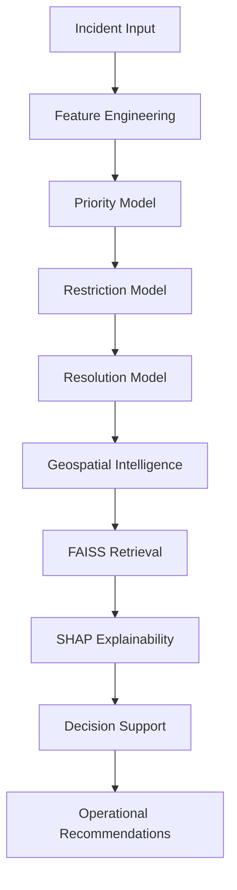

# 🚦 Predictive Incident Management System

AI-Powered Traffic Incident Intelligence & Decision Support Platform

<p align="center">


</p>

---

## 🌐 Live Demo

**Frontend:** (https://predictive-incident-management-syst.vercel.app/)

**Backend API:** https://predictive-incident-management-system.onrender.com

**API Documentation:** https://predictive-incident-management-system.onrender.com/docs

---

## 📸 Dashboard Preview

### Main Dashboard


### Incident Analysis


### Decision Support


---

## 📌 Overview

Predictive Incident Management System is an intelligent traffic operations platform designed to assist traffic authorities in analyzing incidents, predicting operational impact, estimating clearance times, assessing severity, and generating actionable response recommendations.

The platform combines Machine Learning, Geospatial Intelligence, Explainable AI (SHAP), Semantic Incident Retrieval (FAISS), and Decision Support Analytics to improve traffic incident response and resource allocation.

---

## 📈 Project Highlights

* Trained on 8,000+ traffic incident records
* Multi-model architecture using CatBoost
* Geospatial hotspot detection using DBSCAN
* SHAP-based explainability for transparent predictions
* Semantic historical incident retrieval using FAISS and SentenceTransformers
* End-to-end deployment with React, FastAPI, Render, and Vercel
* Operational decision-support recommendations
* What-if simulation engine

---

## 🎯 Problem Statement

Urban traffic management systems often rely on manual assessment of incidents such as:

* Vehicle Breakdowns
* Road Accidents
* Road Obstructions
* Flooding & Waterlogging
* Public Events
* Construction Activities

This can result in:

* Delayed response times
* Poor prioritization
* Increased congestion
* Inefficient resource allocation

This platform automates incident assessment and provides intelligent operational decision support.

---

## ✨ Key Features

### 🚨 Incident Intelligence

* Priority Prediction (Low / Medium / High / Critical)
* Road Restriction Prediction
* Clearance Time Estimation
* Operational Severity Assessment

### 🗺️ Geospatial Intelligence

* Hotspot Detection using DBSCAN Clustering
* Traffic Density Analysis
* Nearest Hotspot Identification
* Spatial Risk Assessment

### 🧠 Explainable AI

* SHAP-Based Feature Importance
* Prediction Narratives
* Transparent Decision Explanations

### 🔍 Semantic Historical Incident Retrieval

* FAISS Vector Search
* SentenceTransformer Embeddings
* Historical Incident Similarity Matching
* Retrieval-Augmented Decision Support

### ⚡ Operational Decision Support

* Resource Allocation Recommendations
* Traffic Officer Deployment Planning
* Cost Estimation
* Incident Timeline Generation
* What-If Scenario Simulation

---

## 🏗️ System Architecture



---

## 🤖 Machine Learning Pipeline

### Models Used

| Task                        | Model               |
| --------------------------- | ------------------- |
| Priority Prediction         | CatBoost Classifier |
| Road Restriction Prediction | CatBoost Classifier |
| Clearance Time Prediction   | CatBoost Regressor  |

### Feature Engineering

* Event Type
* Event Cause
* Zone
* Junction
* Corridor
* Direction
* Latitude
* Longitude
* Time Slot
* Junction Density
* Location Density
* Cluster ID

---

## 🔍 Historical Incident Retrieval using FAISS

The platform incorporates Retrieval-Augmented Decision Support through FAISS.

### Workflow

1. Incident descriptions are converted into semantic embeddings using SentenceTransformers.
2. Embeddings are indexed using FAISS.
3. Incoming incidents are embedded and matched against historical incidents.
4. Similar incidents are retrieved to provide operational context and support decision-making.

### Technologies Used

* FAISS
* SentenceTransformers
* all-MiniLM-L6-v2

This enables the platform to leverage historical incident knowledge beyond structured machine learning predictions.

---

## 📍 Geospatial Intelligence

The platform performs:

* DBSCAN Hotspot Detection
* Traffic Density Mapping
* Spatial Risk Scoring
* Distance-Based Incident Assessment

to identify high-risk traffic zones and support operational planning.

---

## 🛠️ Tech Stack

### Frontend

* React.js
* Leaflet Maps
* Chart.js
* CSS

### Backend

* FastAPI
* Uvicorn

### Machine Learning

* CatBoost
* Scikit-Learn
* SHAP
* NumPy
* Pandas

### Semantic Retrieval

* FAISS
* SentenceTransformers

### Geospatial Analytics

* DBSCAN
* Nearest Neighbors
* Spatial Density Analysis

### Deployment

* Frontend: Vercel
* Backend: Render

---

## 📂 Project Structure

```text
Predictive-Incident-Management-System
│
├── frontend/
│   ├── src/
│   ├── public/
│   └── package.json
│
├── backend/
│   ├── inference_api.py
│   ├── train_ml.py
│   ├── requirements.txt
│   ├── *.cbm
│   ├── *.pkl
│   ├── faiss_index.bin
│   ├── historical_corpus.pkl
│   └── dataset_stats.json
│
└── README.md
```

---

## 🚀 Local Setup

### Clone Repository

```bash
git clone https://github.com/Ahadx488/Predictive-Incident-Management-System.git

cd Predictive-Incident-Management-System
```

### Backend Setup

```bash
cd backend

pip install -r requirements.txt

uvicorn inference_api:app --reload
```

Backend runs at:

```text
http://localhost:8000
```

### Frontend Setup

```bash
cd frontend

npm install

npm start
```

Frontend runs at:

```text
http://localhost:3000
```

---

## 📊 Core Capabilities

✅ Priority Prediction

✅ Road Restriction Prediction

✅ Clearance Time Estimation

✅ Hotspot Detection

✅ SHAP Explainability

✅ FAISS Semantic Retrieval

✅ Spatial Intelligence

✅ Cost Estimation

✅ What-If Simulation

✅ Operational Decision Support

---

## ⚠️ Deployment Note

The complete development version includes transformer-based semantic retrieval using SentenceTransformers and FAISS.

Due to the 512 MB memory limitation of the free Render deployment tier, the public hosted version runs an optimized inference configuration. The complete FAISS-powered retrieval pipeline remains available in the local development build and demonstration environment.

---

## 🔮 Future Enhancements

* Real-Time Traffic API Integration
* Dynamic Route Diversion Suggestions
* Live Sensor Integration
* Advanced NLP Severity Modeling
* Multi-City Deployment Support
* Streaming Incident Analytics

---

⭐ If you found this project interesting, consider giving it a star.
